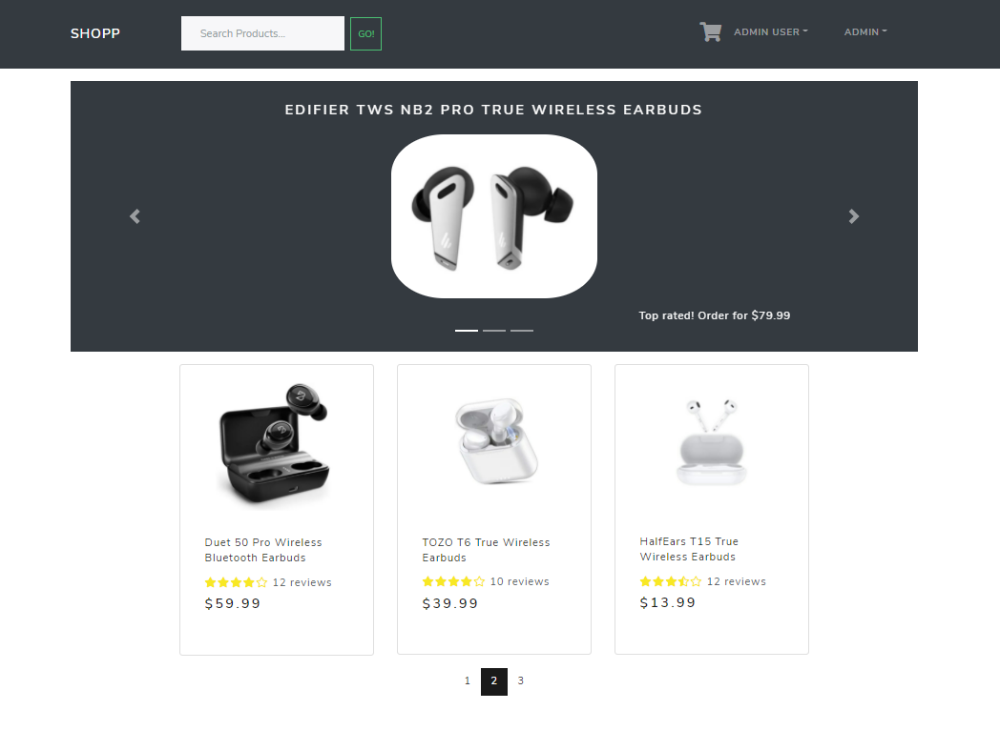

# Shopp E-Commerce Platform

> E-commerce application built with MERN stack, Redux, Mongoose, and React-Bootstrap.



## Features

- Product pages with pagination.
- Top products carousel.
- Product search feature.
- Fully-featured shopping cart.
- Complete checkout process.
- PayPal integration.
- User registration, authorization, and profile.
- Product reviews and ratings.
- Admin panel for users details and orders details management.

## Usage

### ES Modules in Node

Implemented ES6 Modules in the backend of the project. Make sure you have at least Node v14.6+ or you will need to add the "--experimental-modules" flag.

### Environment variables

Create a .env file in the root and add the following:

```
NODE_ENV = development
PORT = 5000
MONGO_URI = <your mongodb uri here>
JWT_SECRET = "789xyz"
PAYPAL_CLIENT_ID = <your paypal client id here>
```

### Install dependencies

```js
// back-end dependencies
npm install

// front-end dependencies
cd frontend
npm install
```

### Run

```js
// Run frontend (:3000) and backend (:5000)

npm run dev

// Run backend only (:5000)

npm run server
```

## Build and deploy

### Create React front-end build

```js
// Create front-end production build
cd frontend
npm run build
```

The Heroku post-build script is included.

### Seed and destroy a database

```js
// Import all data
npm run seed

// Delete all data
npm run destroy
```
